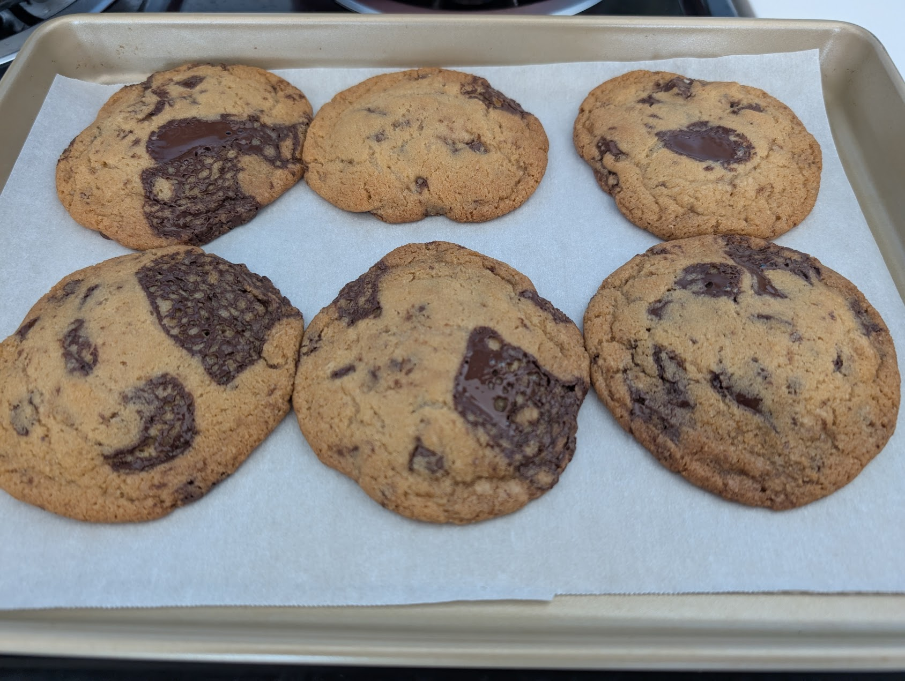

# My Page 
``` std::cout << "Hello World!" ```

Hi! I'm a 3rd year transfer student (from UCM) majoring in [CS](#projects).

[Github](https://github.com/Satellamoon)

## About me
### Personal
I enjoy activities like: 
- cooking 
- baking
  
    Top 3 list:
    1. Cookies
    2. Brownies
    3. Crepes
- spending time with friends.

I also play games ~~6 months hoyo free~~



### CS
Famous last words:
> What could go wrong

I mostly code in [C++](/README.md) and sometimes in Python. I enjoy coding overkill solutions for really simple problems...

Things I've done:
- [x] Personal projects
- [x] Setup Github + Linkedin
- [ ] Internship
- [ ] J o b